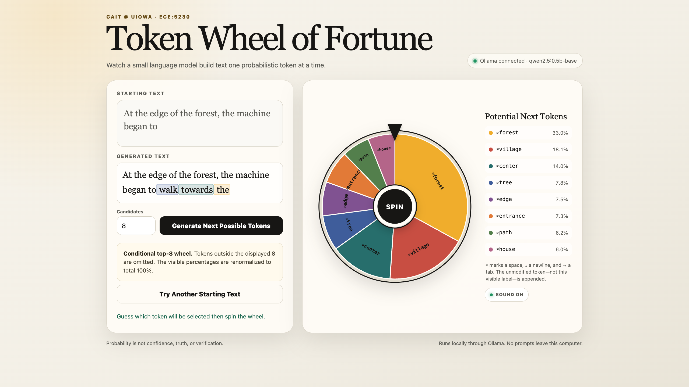

# GAIT Token Wheel of Fortune

This small local classroom demo visualizes next-token sampling as a weighted wheel. A sentence stem is sent to a local Ollama model, the model's displayed top-token log probabilities become wheel weights, and one token is sampled and appended at a time.

The project is self-contained and has no Python package dependencies. It does not use an external website, analytics, or a cloud model.



_A representative run with eight potential next tokens and color-coded generated-token history._

[Watch the representative demo recording (.mp4)](assets/token-wheel-of-fortune-demo.mp4)

## What students should notice

- A language model produces tokens, which may be words, subwords, spaces, punctuation, or newlines.
- More likely tokens occupy more of the wheel, but a less likely displayed token can still be selected.
- The wheel shows only a chosen number of top candidates. It renormalizes those displayed candidates to total 100%.
- A probable continuation is not necessarily confident, true, or verified.

## Requirements

- Python 3.10 or newer
- [Ollama](https://ollama.com/) running locally
- The default model:

  ```sh
  ollama pull qwen2.5:0.5b-base
  ```

The model download is approximately a few hundred megabytes. If the Ollama desktop app is already running, do not start a second Ollama server.

## Run it with uv

If you have [uv](https://docs.astral.sh/uv/) installed, this is the shortest path. From this folder:

```sh
uv run server.py
```

The project uses only Python's standard library, so uv does not need to install any Python packages.

## Run it with Python and pip

Create an isolated environment using Python's built-in `venv`, then run the conventional pip installation command:

```sh
python3 -m venv .venv
source .venv/bin/activate
python -m pip install -r requirements.txt
python server.py
```

On Windows PowerShell, activate the environment with:

```powershell
.venv\Scripts\Activate.ps1
```

`requirements.txt` is intentionally empty except for a note: the current version has no third-party Python dependencies. Keeping the file gives students a familiar workflow and a clear place for future dependencies.

## Run it with system Python

From this folder:

```sh
python3 server.py
```

Then open [http://127.0.0.1:8765](http://127.0.0.1:8765) in a browser. Press `Ctrl-C` in the terminal to stop the local server.

No virtual environment or package installation is required for this option.

Optional command-line settings:

```sh
python3 server.py --port 8765 --model qwen2.5:0.5b-base
```

## Use the wheel

1. Enter a sentence stem or keep the supplied example.
2. Choose how many top candidates to display (2–10, default 8).
3. Select **Generate Next Possible Tokens**.
4. Review the **Potential Next Tokens** and guess which one the wheel will select.
5. Select **Spin**. The chosen raw token is appended exactly, and the next distribution loads automatically.
6. Repeat, change the candidate count, or select **Try Another Starting Text** to begin a new run.

The wheel uses the browser's built-in Web Audio API to synthesize slowing ticks during a spin and a short landing cue. No audio file is required. Sound is on by default and can be muted with the **Sound On/Off** control beside the displayed candidates.

After the first successful candidate generation, the **Starting Text** field locks and remains unchanged for that run. The **Generated Text** view appears after the first spin, keeps the original stem plain, and highlights every wheel-selected token with a light version of its wedge color. These highlights follow token fragments rather than assuming that each token is a complete word. **Try Another Starting Text** clears the highlights and unlocks the starting text for a new run.

The visible labels use `␠` for a space, `↵` for a newline, and `⇥` for a tab. Those labels are only for display; the original token text is appended.

When a student manually enters a stem with trailing spaces or tabs, the interface trims them before requesting candidates and briefly explains why. Tokens selected by the model are never trimmed or altered.

## What the app does

The browser sends the growing text and candidate count to the local Python server. The server calls Ollama's native `/api/generate` endpoint with:

```json
{
  "raw": true,
  "stream": false,
  "logprobs": true,
  "top_logprobs": 8,
  "options": {"num_predict": 1}
}
```

The `top_logprobs` value follows the candidate count selected in the interface; eight is the default.

Ollama must internally select one output token to return information for that position. The app deliberately ignores that selected token and samples from `logprobs[0].top_logprobs` itself, so the visible wheel is the sampler rather than a decorative replay.

For returned log probabilities `lᵢ`, the displayed probability is calculated with a numerically stable softmax over only the shown candidates:

```text
weightᵢ = exp(lᵢ - max(l))
displayed_probabilityᵢ = weightᵢ / sum(weight)
```

This is a **conditional top-k distribution**, not the full vocabulary distribution. Tokens below the selected candidate count are omitted.

## Technical limitation

After each spin, the app appends the selected token's exact text and resubmits the complete growing string. Ollama then tokenizes that string for the next request. A tokenizer may occasionally re-segment text across an earlier token boundary, so the demo is faithful to the accumulated visible text but does not guarantee preservation of an exact alternate token-ID chain. That distinction is acceptable for this introductory classroom visualization.

If Ollama returns an undecodable partial Unicode token, the app stops with a visible error rather than silently changing the token.

## Test without a model call

The deterministic tests validate normalization, whitespace display, and malformed-response handling:

```sh
python3 -m unittest -v test_server.py
```

These tests do not start Ollama or load a model.

## Troubleshooting

- **Could not reach Ollama:** Start the Ollama desktop app or run `ollama serve`, then retry.
- **Model not found:** Run `ollama pull qwen2.5:0.5b-base` and retry.
- **No log probabilities:** Update Ollama to a version whose native `/api/generate` endpoint supports `logprobs` and `top_logprobs`.
- **Port already in use:** Choose another local port, such as `python3 server.py --port 8766`.

## Files

- `server.py` — local static server, Ollama request, validation, and top-k normalization
- `index.html` — complete browser interface and weighted SVG wheel
- `.gitignore` — local Python environment, cache, and macOS metadata exclusions
- `requirements.txt` — explicit no-third-party-dependencies marker for pip/uv workflows
- `test_server.py` — standard-library deterministic tests
- `LICENSE` — MIT license for the source code
- `assets/token-wheel-demo.png` — representative screenshot used in this README
- `assets/token-wheel-of-fortune-demo.mp4` — representative screen recording of the demo in use

## License

The source code is available under the [MIT License](LICENSE). The Ollama model is downloaded separately and is not included in this repository.

## Course status

This is a classroom-tested teaching demo for ECE:5230 Generative AI Tools, Fall 2026. It was used in class on September 1 and passed another live one-spin smoke test on September 2. The source is published in the public [`trbll/llm-token-wheel-of-fortune`](https://github.com/trbll/llm-token-wheel-of-fortune) repository. It has not been shared on ICON or made a student requirement.
